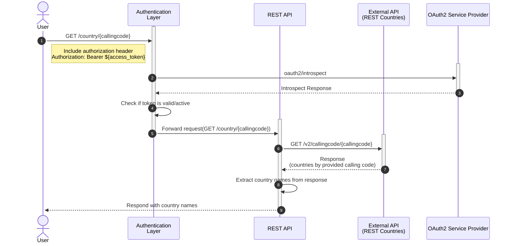

# Ballerina Vs. Spring Boot - REST APIs with OAuth2 Security

## The Scenario



## Requests

### Obtain Access Token - Client Credentials
```curl
curl --location --request POST 'https://api.asgardeo.io/t/imeshaorg/oauth2/token' \
    --header 'Content-Type: application/x-www-form-urlencoded' \
    --data-urlencode 'grant_type=client_credentials' \
    --data-urlencode 'client_id=<client_id>' \
    --data-urlencode 'client_secret=<client_secret>'
```

### Invoke Service - Get Country by Calling Code

```curl
curl --location --request GET 'http://localhost:8080/country/1' \
    --header 'Authorization: Bearer <access_token>'
```

## References

1. Spring OAuth2 Resource Server - https://docs.spring.io/spring-security/reference/servlet/oauth2/resource-server/opaque-token.html
2. BBE OAuth2 Service - https://ballerina.io/learn/by-example/http-service-oauth2/
